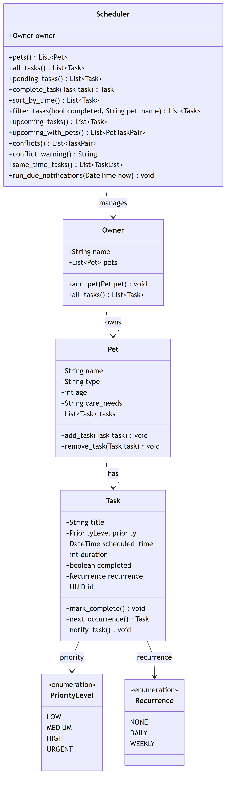

# PawPal+ (Module 2 Project)

**PawPal+** is a Streamlit app that helps a pet owner plan and keep up with daily
care tasks across all of their pets. It builds an ordered daily schedule, warns
about overlapping tasks, and rolls recurring tasks forward automatically. A
command-line demo (`main.py`) exercises the same scheduling engine.

## Scenario

A busy pet owner needs help staying consistent with pet care. They want an assistant that can:

- Track pet care tasks (walks, feeding, meds, enrichment, grooming, etc.)
- Consider constraints (time available, priority, owner preferences)
- Produce a daily plan and explain why it chose that plan

PawPal+ was designed system-first (UML), implemented in Python, and connected to a
Streamlit UI.

## What It Does

PawPal+ lets you:

- Enter basic owner and pet information
- Add care tasks with a duration, priority, time, and optional repeat
- Generate a daily schedule ordered by time and priority
- See the plan clearly, with the reasoning (time first, then priority) made explicit
- Rely on automated tests that cover the most important scheduling behaviors

## ✨ Features

The scheduling engine (`pawpal_system.py`) implements the following algorithms:

- **Sorting by time, then priority** — `upcoming_tasks()` orders pending tasks by
  `scheduled_time`, breaking ties with a priority rank (`URGENT → HIGH → MEDIUM →
  LOW`). `sort_by_time()` gives a pure chronological view of *all* tasks.
- **Conflict detection** — `conflicts()` treats each task as a time window
  `[start, start + duration]` and reports every overlapping pair. Because it scans
  a time-sorted list, it stops early once a later task starts after the current
  one ends (an efficient sweep, not an O(n²) all-pairs check).
- **Conflict warnings** — `conflict_warning()` turns those overlaps into a
  human-readable message and never raises: no conflicts returns an empty string,
  and any unexpected error is folded into the text instead of crashing the caller.
- **Same-time grouping** — `same_time_tasks()` groups pending tasks that share an
  identical start time (the strict double-booking case).
- **Daily & weekly recurrence** — `next_occurrence()` produces a fresh, uncompleted
  copy of a task shifted forward one day or one week; `complete_task()` marks the
  original done and automatically queues that next occurrence on the same pet.
- **Filtering** — `filter_tasks(completed=…, pet_name=…)` narrows tasks by
  completion status and/or pet name (case-insensitive), combining both with AND.
- **Cross-pet views** — `all_tasks()`, `pending_tasks()`, and
  `upcoming_with_pets()` flatten and pair tasks across every pet the owner has.
- **Due notifications** — `run_due_notifications(now)` prints a reminder for each
  pending task whose scheduled time has arrived.
- **Stable task identity** — every `Task` carries a `UUID`, so two field-identical
  tasks stay distinct and removal/completion always target the right instance.

## Getting started

**Requirements:** Python 3.9+

### Setup

```bash
python -m venv .venv
source .venv/bin/activate  # Windows: .venv\Scripts\activate
pip install -r requirements.txt
```

### Running PawPal+

Launch the interactive web app:

```bash
streamlit run app.py
```

Or run the command-line demo, which builds a sample owner with two pets and prints
the schedule, conflicts, and filtered views:

```bash
python main.py
```

### Suggested workflow

1. Read the scenario carefully and identify requirements and edge cases.
2. Draft a UML diagram (classes, attributes, methods, relationships).
3. Convert UML into Python class stubs (no logic yet).
4. Implement scheduling logic in small increments.
5. Add tests to verify key behaviors.
6. Connect your logic to the Streamlit UI in `app.py`.
7. Refine UML so it matches what you actually built.

## 🖥️ Sample Output

A generated daily plan, ordered by time and then priority:

```text
Today's Schedule for Sam
========================================
08:00  [URGENT]  Mochi: Feed (10 min)
08:00  [HIGH  ]  Rex: Morning walk (30 min)
18:00  [URGENT]  Rex: Dinner (10 min)
20:00  [MEDIUM]  Mochi: Litter cleanup (15 min)
```

## 🧪 Testing PawPal+

Run the automated test suite with:

```bash
python -m pytest
```

The tests verify the core functionality of PawPal+, including:

- Task completion
- Adding tasks to pets
- Sorting tasks by scheduled time
- Recurring task scheduling
- Conflict detection and warning messages

### Sample Test Output

```text
python -m pytest
========================================================= test session starts =========================================================
platform win32 -- Python 3.9.13, pytest-8.4.2, pluggy-1.6.0
rootdir: C:\Users\omarb\Downloads\ai110-module2show-pawpal-starter
collected 5 items

tests\test_pawpal.py .....                                                                                                       [100%]

========================================================== 5 passed in 0.02s ==========================================================
```

### Confidence Level

⭐⭐⭐⭐⭐ (5/5)

All automated tests pass successfully. This covers the scheduler's core features: task management, sorting, recurring tasks, and conflict detection. While additional edge-case testing could always be added, the current suite gives strong confidence that the main functionality behaves correctly.

## 🏗️ Class Diagram (UML)

The diagram below reflects the final implementation in `pawpal_system.py` — the
`Scheduler` reads its pets live from the `Owner`, which owns `Pet`s, which each
hold `Task`s.



## 📐 Smarter Scheduling

A quick reference for the `Scheduler` methods behind each feature:

| Feature | Method(s) | Notes |
|---------|-----------|-------|
| Task sorting | `sort_by_time()`, `upcoming_tasks()` | Sorts tasks by scheduled time, then by priority for tasks with the same time. |
| Filtering | `filter_tasks()` | Filters tasks by completion status and/or pet name. |
| Conflict handling | `conflicts()`, `conflict_warning()` | Detects overlapping task times and returns a warning instead of crashing. |
| Recurring tasks | `next_occurrence()`, `complete_task()` | Automatically creates the next daily or weekly task when a recurring task is completed. |

## 📸 Demo Walkthrough

### What you'll see on screen

Start the app with `streamlit run app.py` and it opens in your browser. The page
reads top to bottom, with one section for each step:

- **Owner** — type your name. The app remembers it while you use the page.
- **Add a Pet** — type a pet's name, choose a species, and click **Add pet**. Your
  pets are shown just below so you can see what's been added.
- **Schedule a Task** — pick which pet the task is for, then fill in what it is
  (the title), how long it takes, how important it is, and what time it happens.
  You can also set it to repeat every day or every week. Click **Add task** to save it.
- **Today's Schedule** — your to-do list for the day. Tasks are sorted by time
  (earliest first), and if two are at the same time the more urgent one comes
  first. If two tasks overlap, a ⚠️ warning appears at the top. Finished a task?
  Pick it and click **Done ✓**.
- **Browse & Filter Tasks** — see every task you've added. You can narrow the list
  to one pet, or show only the tasks that are done or still to do.

### Try it yourself

1. Leave the owner name as **Jordan**, or type your own.
2. Add a pet: name it **Mochi**, choose *cat*, and click **Add pet**.
3. Add a task for Mochi: title *Feed*, 10 minutes, priority *urgent*, time *08:00*,
   repeat *daily*. Click **Add task**.
4. Add another task for **08:00** (for example, *Morning walk*) so two things land
   at the same time.
5. Look at **Today's Schedule**: both 08:00 tasks show up together, the more urgent
   one first, and a ⚠️ warning tells you they overlap.
6. Pick *Feed* and click **Done ✓**. It disappears from today's list — and because
   it repeats daily, tomorrow's *Feed* is added for you automatically.
7. In **Browse & Filter Tasks**, choose Mochi and "Completed" to see just her
   finished tasks.

### What this shows the app can do

- **Puts your day in order** — tasks are sorted by time, and ties are broken by how
  urgent they are.
- **Warns you about clashes** — if two tasks overlap, you get a clear ⚠️ heads-up
  instead of a silent double-booking.
- **Handles repeats for you** — finishing a daily or weekly task automatically sets
  up the next one.
- **Lets you find things fast** — filter by pet or by whether a task is done.

### Sample CLI output

The same engine drives the command-line demo. Running `python main.py` produces:

```text
Today's Schedule for Sam
========================================
08:00  [URGENT]  Mochi: Feed (10 min)
08:00  [HIGH  ]  Rex: Morning walk (30 min)
18:00  [URGENT]  Rex: Dinner (10 min)
20:00  [MEDIUM]  Mochi: Litter cleanup (15 min)

Heads up - 1 scheduling conflict(s):
  - Mochi: Feed (08:00) overlaps Rex: Morning walk (08:00)

All tasks sorted by time
========================================
  08:00  Rex: Morning walk (done)
  08:00  Mochi: Feed (pending)
  18:00  Rex: Dinner (pending)
  20:00  Mochi: Litter cleanup (pending)

Rex's tasks (filter by pet name)
========================================
  08:00  Rex: Morning walk (done)
  18:00  Rex: Dinner (pending)

Completed tasks (filter by status)
========================================
  08:00  Rex: Morning walk (done)
```

**Screenshot or video** *(optional)*: <!-- Insert a screenshot or link to a demo video here -->

## 📁 Project Structure

```text
.
├── app.py                 # Streamlit web app
├── main.py                # Command-line demo
├── pawpal_system.py       # Core classes: Owner, Pet, Task, Scheduler, enums
├── requirements.txt       # Dependencies (streamlit, pytest)
├── diagrams/
│   ├── uml_final.mmd       # Class diagram (Mermaid source)
│   └── uml_final.png       # Rendered class diagram
└── tests/
    └── test_pawpal.py     # Automated test suite
```
